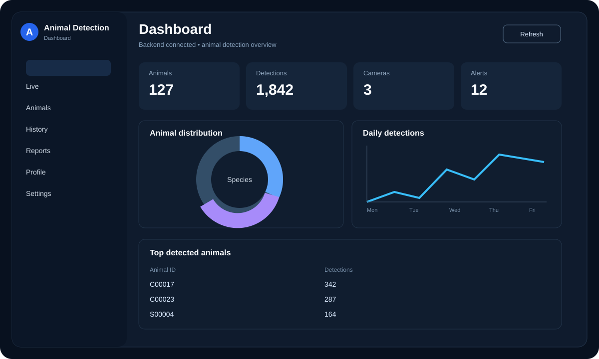
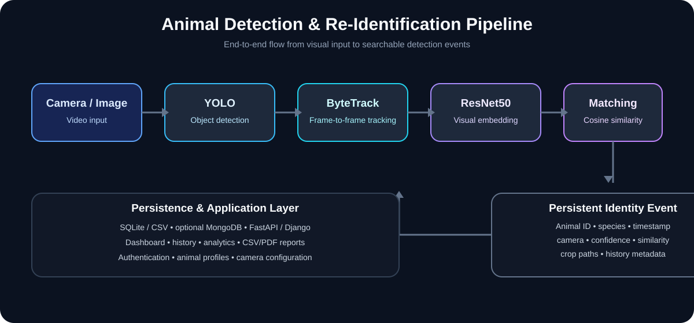

# Animal Detection & Re-Identification System

A Python computer-vision project for detecting livestock, tracking animals across video frames, and assigning persistent visual re-identification IDs using **YOLO, ByteTrack, ResNet50 embeddings, and similarity matching**.

> **Portfolio status:** Core implementation, frontend/API integration, automated tests, CI, and deterministic runtime validation are complete. Production deployment and animal-specific biometric accuracy remain unvalidated.

## Dashboard Preview



The frontend provides a dashboard with **Dashboard, Live, Animals, History, Reports, Profile, and Settings** views. It connects to the FastAPI backend for live data and operations.

## Architecture



## What the system does

```text
Camera / Image / Video
        ↓
YOLO Detection
        ↓
ByteTrack Tracking
        ↓
ResNet50 Visual Embedding
        ↓
Similarity Matching
   ┌────┴─────┐
 MATCH      NO MATCH
   ↓            ↓
Existing ID   New Animal ID
   └────┬─────┘
        ↓
Detection Event
  • Animal ID
  • Species
  • Timestamp
  • Camera ID
  • Camera Location
  • Detection Confidence
  • Similarity Score
        ↓
SQLite / CSV / optional MongoDB
        ↓
History / Analytics / Reports
```

## Key Features

- **Animal detection** using YOLOv8/Ultralytics
- **Object tracking** using ByteTrack
- **Persistent animal IDs** such as `C00017`, `S00004`, and `O00002`
- **Visual re-identification** using normalized ResNet50 embeddings
- **Weighted cosine-similarity matching** with configurable threshold
- **Region-based crops** for visual matching
- **Camera registry** with camera ID and location metadata
- **Detection events** containing identity, timestamp, confidence, similarity, and camera metadata
- **Animal profiles** with automatic profile creation
- **FastAPI backend** for authentication, identification, animals, history, analytics, and reports
- **Django models/admin** with migrations
- **Web dashboard** for live detection controls, profiles, history, analytics, and reports
- **Image analysis** and live webcam/video processing
- **CSV/PDF reporting**
- **Automated regression and API smoke tests** with GitHub Actions CI

## Technology Stack

| Layer | Technology |
|---|---|
| Detection | YOLOv8 / Ultralytics |
| Tracking | ByteTrack |
| Feature extraction | ResNet50 / PyTorch / TorchVision |
| Computer vision | OpenCV |
| API | FastAPI |
| Web/admin layer | Django |
| Storage | SQLite / SQLAlchemy / CSV; MongoDB optional |
| Frontend | HTML, CSS, Bootstrap 5, JavaScript, Chart.js |
| Authentication | JWT-style bearer authentication |
| Testing / CI | Pytest / GitHub Actions |

## Repository Structure

```text
animal-detection/
├── backend/
│   ├── api/                 # API routes and views
│   ├── models/              # Detector, tracker, embedding, recognizer
│   ├── services/            # Detection, animal, alert, health services
│   ├── database/            # SQLite, CSV, MongoDB adapters
│   ├── utils/               # Camera, image, similarity and security helpers
│   ├── accounts/            # Django authentication app
│   ├── animals/             # Animal profiles and images
│   ├── identification/      # Identification jobs/results
│   ├── analytics_app/       # Analytics models and views
│   ├── reports/             # Report endpoints
│   ├── dashboard/           # Django dashboard modules
│   ├── backend_site/        # Django project configuration
│   ├── app.py               # FastAPI entry point
│   ├── config.py            # Environment/configuration
│   ├── manage.py            # Django management entry point
│   └── requirements.txt
├── frontend/                 # Static web dashboard
├── tests/                    # Regression and API tests
├── scripts/                  # Development/validation helpers
├── docs/                     # Testing, architecture and project docs
├── .github/workflows/        # Continuous integration
├── .gitignore
├── LICENSE
└── README.md
```

## Quick Start

### 1. Backend setup

```powershell
cd backend
python -m venv .venv
.\.venv\Scripts\Activate.ps1
python -m pip install --upgrade pip
pip install -r requirements.txt
copy .env.example .env
```

### 2. Start the FastAPI service

```powershell
uvicorn app:app --reload
```

The development API is expected at `http://127.0.0.1:8000`.

### 3. Start the frontend

From the repository root, serve the static dashboard with any local HTTP server, for example:

```powershell
python -m http.server 5500 --directory frontend
```

Then open the local frontend in a browser. The API base URL can be configured with `window.ANIMAL_API_BASE_URL` when needed.

### 4. Run tests

From the repository root:

```powershell
pytest -q
```

GitHub Actions runs the regression suite against the backend dependency set.

### 5. Validate the local runtime

```powershell
python scripts/validate_runtime.py
```

The validator checks the core API/ML dependencies. If `YOLO_MODEL_PATH` or `backend/yolov8n.pt` is available, it also loads the detector and runs one synthetic-image inference. A missing model is reported as **NOT RUN**, not as a passing inference test.

## Frontend Workflow

```text
Login
  ↓
Dashboard
  ├── Live camera → Start / Stop detection
  ├── Animals → Persistent animal profiles
  ├── History → Filters and detection events
  ├── Reports → CSV / PDF
  ├── Image analysis → Upload and identify
  └── Settings → Detection configuration
```

## API Areas

The backend includes routes for:

- Authentication and current-user information
- Animal registration and animal profiles
- Image/video identification
- Detection history with filters and pagination
- Analytics
- CSV/PDF reports
- Live detection/video processing

The exact route definitions are maintained in the backend API and application URL modules.

## Recognition Approach

The current re-identification pipeline is a **visual similarity system**:

1. Detect an animal with YOLO.
2. Track the detection with ByteTrack.
3. Generate a normalized ResNet50 embedding from the animal crop.
4. Compare the embedding with stored embeddings for the relevant species.
5. Reuse an existing animal ID when similarity exceeds the configured threshold; otherwise create a new ID.
6. Update the stored representation using the configured embedding momentum.

This demonstrates an end-to-end re-identification architecture, but it should not be presented as a scientifically validated biometric system.

## Testing & Validation

The repository includes regression tests covering API smoke behavior, detector/species mapping, camera configuration, recognition behavior, identity-event metadata, identity-pipeline behavior, and frontend/API contracts.

GitHub Actions installs `backend/requirements.txt` and runs `pytest -q` with the repository root on `PYTHONPATH`.

See [`docs/TESTING.md`](docs/TESTING.md) for the complete validation procedure and the distinction between automated tests and real model/camera validation.

### Validation Status

- **Automated regression tests:** validated in GitHub Actions.
- **API smoke tests:** validated in GitHub Actions.
- **Inference-result parsing:** covered by deterministic tests without requiring a camera.
- **Real YOLO inference:** model/environment dependent; claim PASS only when a compatible weight is actually loaded and inference succeeds.
- **Real camera/video accuracy:** not benchmarked in this repository yet.
- **Production performance/security:** not validated.

## Important Limitations

- Generic pretrained ResNet50 embeddings are used; the model is not specifically trained for livestock identity recognition.
- Region crops are an early visual-feature strategy, not specialized nose/ear/stripe/fur biometric models.
- Similarity thresholds are configurable and have not been validated as production-grade accuracy metrics.
- Standard COCO detector weights do not provide validated coverage for every livestock species. Buffalo recognition requires appropriate custom detector weights if buffalo detection is required.
- Camera location is configuration metadata; the application does not automatically determine physical geolocation.
- Production deployment, large-scale performance, security hardening, and real-world accuracy still require environment-specific validation.

## Development Roadmap

- [x] Repository cleanup and project documentation
- [x] YOLO detection and ByteTrack tracking architecture
- [x] Visual embedding and similarity recognition architecture
- [x] Persistent animal ID generation
- [x] Camera ID/location identity events
- [x] Complete backend source integration
- [x] Frontend dashboard and API integration
- [x] Regression test suite and CI workflow
- [x] Deterministic runtime/inference validation coverage
- [x] Recruiter-facing README visuals and architecture documentation
- [ ] Full environment-based runtime validation with real camera/video data
- [ ] Animal-specific embedding training/evaluation
- [ ] Production deployment and monitoring
- [ ] Demo dataset and measured performance benchmarks

## License

See [`LICENSE`](LICENSE).
